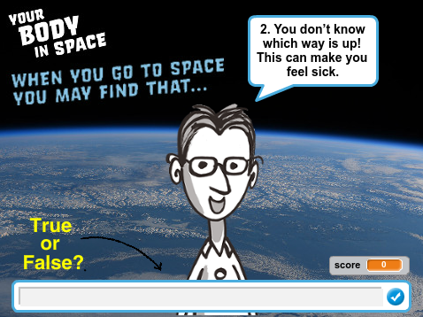

## Introduction

On 15 December 2015, British astronaut Tim Peake set off on the Principia mission to the International Space Station which is in orbit around Earth. This project ties in with the The Principia Space Diary, a free resource for UK schools, produced as part of European Space Agency Astronaut Tim Peake’s Principia Mission. For more information about the Space Diary, visit [http://principiaspacediary.org](http://principiaspacediary.org).

You are going to create your own space quiz using facts about your body in space. This quiz is based on the activity on page 6 of the Space Diary. 

  <iframe allowtransparency="true" width="485" height="402" src="https://scratch.mit.edu/projects/embed/135911076/?autostart=false" frameborder="0"></iframe>
  

### Additional information for club leaders

If you need to print this project, please use the [Printer friendly version](https://projects.raspberry-pi.org/en/projects/space-body-quiz/print).

--- collapse ---
---
title: Club leader notes
---

## Introduction:
In this project, children will learn how to make decisions based on user input. They will also learn about how space affects the human body. 

## Space Diary
This project ties in with the The Principia Space Diary, a free resource for UK schools, produced as part of European Space Agency Astronaut Tim Peake’s Principia Mission.

You can find out more at the <a href="http://principiaspacediary.org/" target="_blank">http://principiaspacediary.org/</a> website. 

## Resources
For this project, Scratch 2 should be used. Scratch 2 can either be used online at [jumpto.cc/scratch-on](http://jumpto.cc/scratch-on) or can be downloaded from [jumpto.cc/scratch-off](http://jumpto.cc/scratch-off) and used offline.

The 'Project Materials' link for this project contains the following resources:

##### Club leader Resources

You can find a completed version of this project <a href="http://scratch.mit.edu/projects/135911076/#editor">online</a>, or it can be downloaded by clicking the 'Project Materials' link for this project, which contains:

+ YourBodyInSpace.sb2

##### Project Resources

For this project, club members can make use of a Scratch project containing the required resources. This project is available at [jumpto.cc/body-go](http://jumpto.cc/body-go), or it can be downloaded by clicking the 'Project Materials' link for this project, which contains:

+ YourBodyinSpaceResources.sb2

Make sure that each child has access to a copy of these resources.

## Learning Objectives
+ User Input;
+ Conditions (= operator);
+ Selection (if / else).

This project covers elements from the following strands of the [Raspberry Pi Digital Making Curriculum](http://rpf.io/curriculum):

+ [Combine programming constructs to solve a problem.](https://www.raspberrypi.org/curriculum/programming/builder)

## Challenges
+ "Add more questions" - Add more questions to the quiz using the included questions and answers or by researching your own.

--- /collapse ---

--- collapse ---
---
title: Project materials
---
## Project resources
* [Online Scratch 2 project containing all project resources](http://jumpto.cc/body-go)
* [Downloadable Scratch 2 project containing all project resources](resources/YourBodyinSpaceResources.sb2)

## Club leader resources
* [Online completed Scratch 2 project](http://scratch.mit.edu/projects/135911076/#editor)
* [Downloadable completed Scratch 2 project](resources/YourBodyinSpace.sb2)

--- /collapse ---
