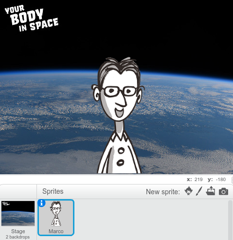
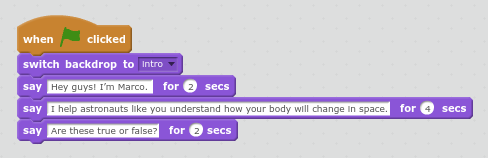

## Let's meet Marco.

Let's introduce Marco, he teaches astronauts like you how your body will change in space. 

+ Open the 'Space Diary Quiz' Scratch project. Your club leader will give you a copy of this project, or you can open it online at <a href="http://jumpto.cc/body-go" target="_blank">jumpto.cc/body-go</a>.

	Your project should look like this:

	

+ Click on your 'Marco' sprite, and add the following code to make sure the intro backdrop is displaying and get Marco to introduce himself:

	

+ Click the green flag to run your project. If you like you can change the amount of time Marco says each thing for.

