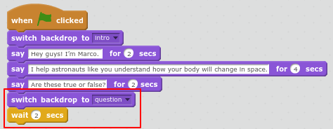
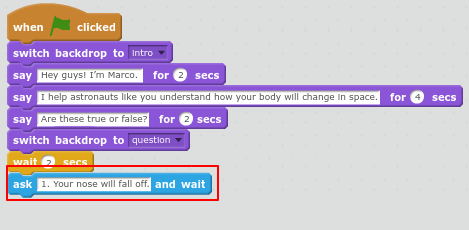
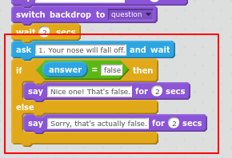
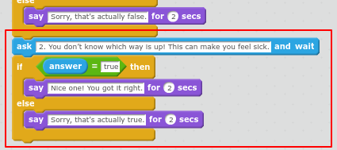

## Add the first question.

Now let's get Marco to ask a true/false question about your body in space. 

+ First let's change the backdrop and add a pause before the first question. Add the highlighted code at the end of Marco's code:

	

+ Add the highlighted code to complete the first question:

	
	
+ Now you need to check the answer. An `if/else`{:class="blockcontrol"} block allows you to do something different depending on whether the question is answered correctly or not. 

	Add the highlighted code:

	
	

+ Click the green flag to test your quiz question. Make sure you try the correct answer (false) and an incorrect one (true or anything else.) You can use capital letters or lower case letters. Try it. 

+ Now add another question. This time the correct answer is 'true'.

	Add the highlighted code:
	
	

