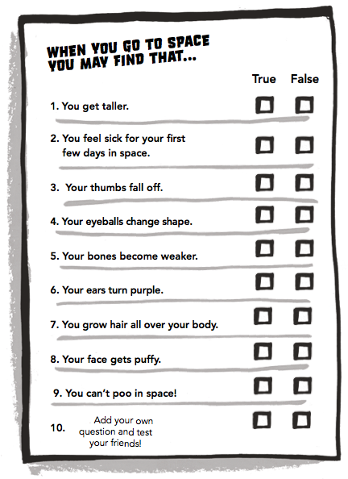

--- challenge ---
## Challenge: Add more questions
Can you add more true/false questions to your quiz? 

You could use the questions from the space diary. You could also research your own questions. 

And here are the answers:

####### The following questions are all true:

+ 1. You get taller;
+ 2. You feel sick for your first few days in space;
+ 4. Your eyeballs change shape;
+ 5. Your bones become weaker;
+ 8. Your face gets puffy.

--- /challenge ---